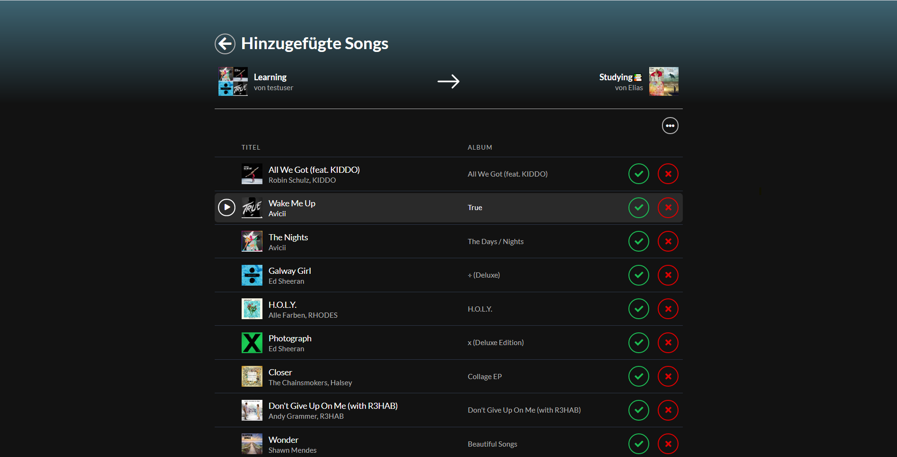

# spotify-playlist-observer
This application displays the changes in a foreign Spotify playlist on a webpage and allows the user to adopt them into its own playlist.

## Requirements

- MongoDB
- MongoDB PHP-extension enabled
- cURL PHP-extension enabled

## Installation
1. copy `.env.example` to `.env` and set the environment variables
2. Install PHP dependencies
    - `composer install`
3. Build CSS & JS
    - `npm install`
    - `npm run build-dev` for development build or `npm run build-prod` for production build